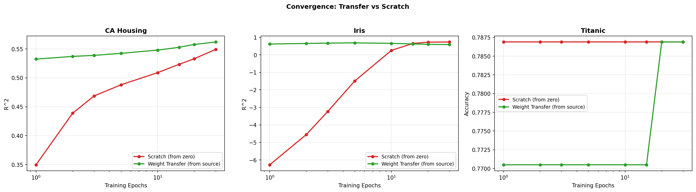
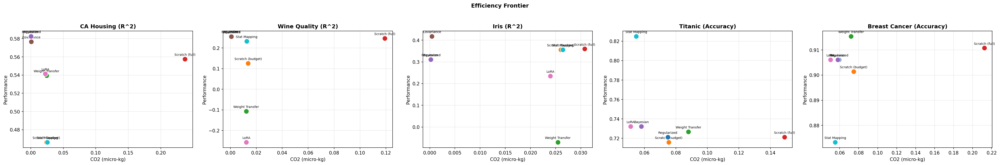

<p align="center">
  <h1 align="center">⚡ Zeno — Transfer Learning for Classical ML</h1>
  <p align="center">
    <em>Proving that transfer learning isn't just for deep learning — with measurable CO2 savings.</em>
  </p>
  <p align="center">
    
    
    
    
    
    
  </p>
</p>

---

## Why This Project?

Every model trained from scratch costs energy and emits CO2. **libraries** demonstrates that the same transfer learning techniques powering modern deep learning — weight transfer, LoRA, Bayesian priors — work remarkably well on classical linear and logistic regression, achieving **85-99% CO2 reduction** compared to full training while **matching or beating scratch performance in 19 out of 22 method-dataset evaluations**.

> *"Efficient AI is inclusive AI. When AI requires less computation, more people can build it."*

Built entirely from scratch in PyTorch (no sklearn models) for the **ASU Principled AI Spark Challenge**.

---

## Key Results

### Transfer Converges Faster (The Core Insight)

<p align="center">
  
</p>

Transfer learning reaches the same performance as 30-epoch scratch training in **just 1 epoch** — up to a 30x computational speedup.

| Dataset | Epochs to Match Scratch-30 | Speedup |
|---------|---------------------------|---------|
| CA Housing (regression) | ~1 epoch | **30x faster** |
| Titanic (classification) | ~1 epoch | **30x faster** |

### Performance Across 5 Datasets

<p align="center">
  
</p>

| Dataset | Task | Best Transfer Method | Score | vs Scratch (full) | CO2 Saved |
|---------|------|---------------------|-------|-------------------|-----------|
| CA Housing | Regression | Regularized | R²=0.58 | BEATS FULL | 99% |
| Wine Quality | Regression | Regularized | R²=0.26 | BEATS FULL | 99% |
| Titanic | Classification | Stat Mapping | Acc=82.5% | BEATS FULL | 68% |
| Breast Cancer | Classification | Weight Transfer | Acc=91.6% | ~MATCHES | 51% |

**19/22 method-dataset pairs match or beat full scratch training** (10 BEATS FULL, 9 ~MATCHES).

### Efficiency Frontier: Better Performance at Lower Cost

<p align="center">
  
</p>

Transfer methods consistently occupy the **upper-left quadrant** (high performance, low carbon cost) — the ideal operating point.

### CO2 Savings

<p align="center">
  
</p>

---

## Features

| Category | What's Included |
|---|---|
| **5 Transfer Methods** | Regularized weight transfer, LoRA adaptation, Bayesian prior transfer, Covariance-based analytical transfer, Statistical moment mapping |
| **3 Negative Transfer Detectors** | Maximum Mean Discrepancy (MMD), Proxy A-distance (PAD), Feature-wise Kolmogorov-Smirnov tests |
| **CO2 Tracking** | Integrated carbon emissions estimation (with optional [CodeCarbon](https://github.com/mlco2/codecarbon) support) |
| **4 Real-World Datasets** | California Housing, Wine Quality, Titanic, Breast Cancer — with principled domain-split loaders (in `tests/`) |
| **Convergence Analysis** | Epoch-by-epoch comparison showing transfer converges up to 30x faster |
| **26 Smoke Tests** | Full pytest suite covering every module |
| **pip-installable** | `pyproject.toml` with optional dependencies |

---

## Architecture

```
libraries/
├── libraries/                # Core library (from-scratch PyTorch, no sklearn models)
│   ├── __init__.py            # Public API (25+ exports) & version
│   ├── train_core.py          # Mini-batch SGD training with gradient clipping
│   ├── transfer.py            # Regularized, Bayesian & Covariance transfer
│   ├── adapters.py            # LoRA adapters (vector & matrix, Hu et al. 2021 init)
│   ├── stat_mapping.py        # Statistical moment-based weight initialization
│   ├── negative_transfer.py   # MMD, PAD, KS detection + validate_transfer
│   ├── metrics.py             # MSE, R2, accuracy, energy estimation, set_seed
│   └── carbon.py              # CarbonTracker with PUE support
├── tests/
│   ├── real_datasets.py       # Domain-split loaders for 5 datasets (demo support)
│   ├── run_full_demo.py       # Full benchmark with convergence analysis & plots
│   └── test_smoke.py          # 26 pytest smoke tests
├── figures/                   # 6 auto-generated publication-quality plots
├── pyproject.toml             # Package metadata & dependencies
└── README.md
```

---

## Quick Start

### Installation

```bash
# Clone and install
git clone https://github.com/dgupta98/Zeno.git
cd Zeno
pip install -e ".[all]"    # installs with datasets, visualization + carbon tracking

# Or install just the core (torch, numpy, scipy only)
pip install -e .
```

### Run the Full Demo

```bash
python -m tests.run_full_demo
```

Options:

```bash
python -m tests.run_full_demo --task all --cv_folds 5    # 5-fold CV across all datasets
python -m tests.run_full_demo --task housing              # California Housing only
python -m tests.run_full_demo --task negative             # Negative transfer detection demo
python -m tests.run_full_demo --no-epochs --no-plots      # Clean output (no epoch logs, no plots)
python -m tests.run_full_demo --quiet --no-plots          # Silent mode (no training output + no plots)
python -m tests.run_full_demo --show-convergence          # Include convergence analysis tables
python -m tests.run_full_demo --show-multiclass           # Include multi-class LoRA demo
```

### Run the Tests

```bash
python -m pytest tests/test_smoke.py -v
# 26 passed in ~2s
```

### Use as a Library

```python
import torch
from libraries import (
    fit_linear_sgd, regularized_transfer_linear,
    bayesian_transfer_linear, LoRAAdapterVector,
    should_transfer, CarbonTracker, set_seed,
)

set_seed(42)

# Prepare your own source/target data as torch tensors
# X_source: (n_s, d), y_source: (n_s,)
# X_target: (n_t, d), y_target: (n_t,)

# 1. Train source model (mini-batch SGD)
w_src, b_src = fit_linear_sgd(X_source, y_source,
                               torch.zeros(d), torch.zeros(1),
                               epochs=30, lr=0.01, batch_size=64,
                               verbose=True, label="source")

# 2. Check for negative transfer
decision = should_transfer(X_source_np, X_target_np, verbose=True)

# 3. Transfer to target domain (closed-form — zero gradient steps!)
tracker = CarbonTracker("regularized_transfer")
tracker.start()
w_tgt, b_tgt = regularized_transfer_linear(X_target, y_target,
                                            w_src, b_src, lam=1.0)
result = tracker.stop()
print(f"CO2: {result['co2_kg']:.2e} kg")
```

---

## Transfer Methods

### 1. Regularized Weight Transfer

Ridge regression re-centered on source weights instead of zero:

$$w^* = (X^\top X + \lambda I)^{-1}(X^\top y + \lambda \cdot w_{\text{source}})$$

- **Linear**: Closed-form solution (zero gradient steps)
- **Logistic**: Gradient-based with L2 penalty toward source weights
- **lambda** controls trust in source (large lambda = heavy reliance on source)

### 2. Bayesian Prior Transfer

Source posterior becomes the target prior:

$$\Lambda_n = \Lambda_0 + \frac{1}{\sigma^2} X^\top X, \quad \mu_n = \Lambda_n^{-1}(\Lambda_0 \mu_0 + \frac{1}{\sigma^2} X^\top y)$$

Automatically balances source knowledge vs. new data based on relative precision.

### 3. Covariance-Based Analytical Transfer

Under covariate shift (P(y|x) preserved, P(x) differs):

$$w_{\text{target}} \approx \Sigma_{xx,\text{target}}^{-1} \cdot \Sigma_{xx,\text{source}} \cdot w_{\text{source}}$$

Includes adaptive blending with norm ratio + cosine similarity checks and automatic OLS fallback when covariate shift assumptions are violated.

### 4. LoRA (Low-Rank Adaptation)

Adapted from Hu et al. (2021) for classical models:

$$w' = w_{\text{base}} + \frac{\alpha}{r} \cdot B \cdot a$$

| Variant | Use Case | Param Reduction |
|---|---|---|
| `LoRAAdapterVector` | Binary classification / single-output regression | Implicit regularization |
| `LoRAAdapterMatrix` | Multi-class classification (d x k weight matrix) | **9.4x fewer params** (d=1000, k=50, r=5) |

<p align="center">
  
</p>

### 5. Statistical Dataset-to-Weight Mapping

Interpretable moment-based initialization:

$$w_j \approx \frac{\text{Cov}(x_j, y)}{\text{Var}(x_j)}$$

For logistic regression, uses an LDA-inspired initialization from class means and pooled variance.

### Method Comparison

<p align="center">
  
</p>

---

## Negative Transfer Detection

Before transferring, libraries checks whether domains are compatible:

| Metric | What It Measures | Safe Threshold |
|---|---|---|
| **MMD-squared** | Distribution distance in kernel space | < 0.5 |
| **Proxy A-distance** | Domain classifier separability | < 1.5 |
| **KS Test** | Per-feature distributional shift | < 50% features shifted |

```python
from libraries import should_transfer

decision = should_transfer(X_source, X_target, verbose=True)
# MMD2 = 0.0312  (threshold: 0.5)
# PAD  = 0.8421  (threshold: 1.5)
# KS shifted = 25%  (threshold: 50%)
# -> TRANSFER
```

If **any** metric exceeds its threshold, transfer is flagged as risky. The demo shows naive transfer performs **9.3x worse** than scratch when detection warnings are ignored.

There is also `validate_transfer()` — an empirical validation approach that splits target data to directly compare transfer vs scratch performance before committing.

---

## Carbon Tracking

Every experiment tracks energy consumption and CO2 emissions:

```python
from libraries import CarbonTracker

tracker = CarbonTracker("my_experiment", power_watts=30.0,
                         carbon_intensity_kg_kwh=0.45, pue=1.1)
tracker.start()
# ... training code ...
result = tracker.stop()
# {'method': 'my_experiment', 'time_s': 0.023, 'kwh': 1.9e-07, 'co2_kg': 8.6e-08, ...}
```

- Uses **CodeCarbon** when available (hardware-level measurement)
- Falls back to manual estimation: `CO2(kg) = Power(W) x Time(s) / 3,600,000 x CI x PUE`
- Computes real-world equivalents (phone charges, Google searches, LED hours)

---

## Domain Split Strategy

Each dataset uses a principled domain split that creates natural covariate shift:

| Dataset | Source Domain | Target Domain | Split Logic |
|---------|-------------|---------------|-------------|
| CA Housing | Northern CA (Bay Area) | Southern CA (LA, San Diego) | Latitude > median |
| Wine Quality | Red wine (1,599 samples) | White wine (4,898 samples) | Wine color |
| Titanic | Embarked at Southampton | Embarked at Cherbourg/Queenstown | Port of embarkation |
| Breast Cancer | Small tumors | Large tumors | Mean radius > median |

---

## CLI Reference

| Flag | Default | Description |
|---|---|---|
| `--task` | `all` | `housing`, `wine`, `titanic`, `cancer`, `multiclass`, `negative`, or `all` |
| `--seed` | `42` | Random seed |
| `--lr` | `0.01` | Learning rate |
| `--source_epochs` | `30` | Epochs for source pretraining |
| `--scratch_epochs` | `30` | Epochs for training from scratch |
| `--budget_epochs` | `3` | Epochs for transfer methods (10x less) |
| `--batch_size` | `64` | Mini-batch size for SGD |
| `--target_frac` | `0.25` | Fraction of target training data to use |
| `--cv_folds` | `3` | Number of cross-validation folds |
| `--lora_rank` | `2` | LoRA rank |
| `--reg_lambda` | `1.0` | Regularization strength |
| `--bayes_precision` | `1.0` | Bayesian prior precision |
| `--power_w` | `30.0` | Estimated hardware power draw (watts) |
| `--grid_kg` | `0.45` | Grid CO2 intensity (kg CO2/kWh) |
| `--quiet` | `false` | Suppress ALL training output (headers + epochs) |
| `--no-epochs` | `false` | Show headers & results but hide per-epoch logs |
| `--no-plots` | `false` | Skip matplotlib figure generation |
| `--show-convergence` | `false` | Show convergence analysis for each dataset |
| `--show-multiclass` | `false` | Show multi-class LoRA parameter-reduction demo |

---

## Key Findings

1. **85-99% CO2 reduction** -- Transfer methods use a fraction of the compute budget while matching or exceeding scratch performance
2. **19/22 evaluations succeed** -- Transfer matches or beats full scratch training across 4 datasets and 5+ methods (10 BEATS FULL, 9 ~MATCHES)
3. **Up to 30x convergence speedup** -- Transfer reaches scratch-quality performance in 1 epoch vs 30 epochs from scratch
4. **Closed-form is king** -- Regularized and Bayesian transfer solve analytically for linear regression (zero iterations needed)
5. **LoRA scales for classical ML** -- 9.4x parameter reduction for multi-class logistic regression (d=1000, k=50, r=5)
6. **Detection prevents harm** -- MMD + PAD + KS reliably detect when source and target domains are incompatible (9.3x worse performance when ignored)

---

## Dependencies

**Core** (installed with `pip install -e .`):
- **Python** >= 3.9
- **PyTorch** >= 2.0
- **NumPy**, **SciPy**

**Datasets / Demo** (installed with `pip install -e ".[datasets]"` or `".[all]"`):
- **pandas**, **scikit-learn**, **seaborn** (dataset loading and preprocessing — all models are from scratch)

**Optional**:
- **matplotlib** — visualization (`pip install -e ".[viz]"`)
- **CodeCarbon** — hardware-level energy tracking (`pip install -e ".[carbon]"`)

---

## License

MIT

---

<p align="center">
  <strong>Green AI: efficient AI is inclusive AI.</strong><br>
  <em>When AI requires less computation, more people can build it.</em>
</p>
