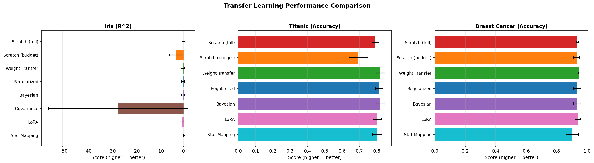
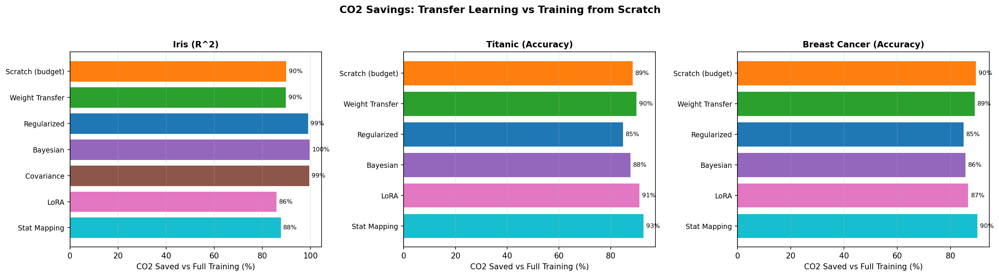
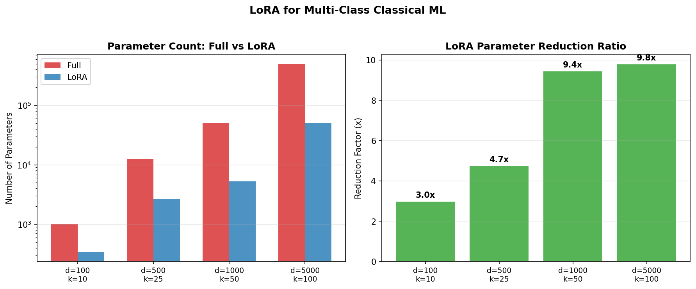
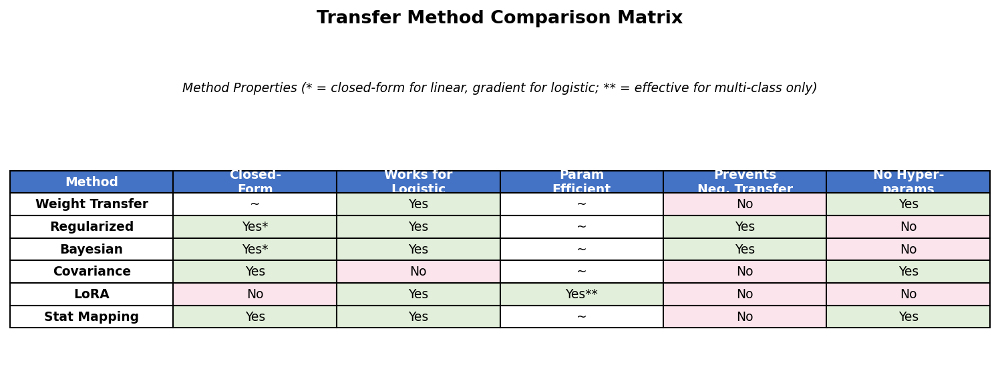

<p align="center">
  <h1 align="center">⚡ Zeno — Transfer Learning for Classical ML</h1>
  <p align="center">
    <em>Proving that transfer learning isn't just for deep learning — with measurable CO₂ savings.</em>
  </p>
  <p align="center">
    
    
    
    
    
  </p>
</p>

---

## 🌍 Why Zeno?

Every model trained from scratch costs energy and emits CO₂. **Zeno** (`libaaraies`) demonstrates that the same transfer learning techniques powering modern deep learning — weight transfer, LoRA, Bayesian priors — work remarkably well on classical linear and logistic regression, achieving **85–99% CO₂ reduction** compared to full training.

> *"Efficient AI is inclusive AI. When AI requires less computation, more people can build it."*

Built for the **ASU Principled AI Spark Challenge**.

---

## ✨ Features

| Category | What's Included |
|---|---|
| **4 Transfer Methods** | Regularized weight transfer, LoRA (low-rank adaptation), Statistical dataset-to-weight mapping, Bayesian prior transfer |
| **3 Negative Transfer Detectors** | Maximum Mean Discrepancy (MMD), Proxy A-distance (PAD), Feature-wise Kolmogorov-Smirnov tests |
| **CO₂ Tracking** | Integrated carbon emissions estimation (with optional [CodeCarbon](https://github.com/mlco2/codecarbon) support) |
| **Real-World Datasets** | Iris, Titanic, Breast Cancer Wisconsin, Wine Quality — with domain-split loaders |
| **Cross-Validated Benchmarks** | Full demo with multi-fold CV, publication-quality plots, and CO₂ equivalents |

---

## 🏗️ Architecture

```
Zeno/
├── libaaraies/              # Core library (from-scratch, minimal dependencies)
│   ├── __init__.py          # Public API & version
│   ├── train_core.py        # SGD training for linear & logistic regression
│   ├── transfer.py          # Regularized, Bayesian & Covariance transfer
│   ├── adapters.py          # LoRA adapters (vector & matrix variants)
│   ├── stat_mapping.py      # Statistical moment-based weight initialization
│   ├── negative_transfer.py # MMD, Proxy A-distance, KS detection
│   ├── metrics.py           # MSE, R², accuracy, energy estimation
│   ├── carbon.py            # CarbonTracker with CodeCarbon fallback
│   └── real_datasets.py     # Domain-split loaders for real datasets
├── tests/
│   └── run_full_demo.py     # Full benchmark suite with visualization
├── figures/                 # Auto-generated plots from demo runs
└── README.md
```

---

## 🚀 Quick Start

### Installation

```bash
git clone https://github.com/dgupta98/Zeno.git
cd Zeno
pip install torch numpy scipy pandas scikit-learn matplotlib seaborn
```

### Run the Full Demo

```bash
cd Zeno
python -m tests.run_full_demo
```

Options:

```bash
python -m tests.run_full_demo --task all --cv_folds 5    # 5-fold CV across all datasets
python -m tests.run_full_demo --task titanic              # Titanic only
python -m tests.run_full_demo --task negative             # Negative transfer detection demo
python -m tests.run_full_demo --no-plots                  # Skip matplotlib visualizations
```

### Use as a Library

```python
import torch
from libaaraies import (
    fit_linear_sgd, regularized_transfer_linear,
    bayesian_transfer_linear, LoRAAdapterVector,
    should_transfer, CarbonTracker,
)

# 1. Train source model
w_src, b_src = fit_linear_sgd(X_source, y_source,
                               torch.zeros(d), torch.zeros(1),
                               steps=400, lr=0.1)

# 2. Check for negative transfer
decision = should_transfer(X_source_np, X_target_np, verbose=True)

# 3. Transfer to target domain (closed-form!)
tracker = CarbonTracker("regularized_transfer")
tracker.start()
w_tgt, b_tgt = regularized_transfer_linear(X_target, y_target,
                                            w_src, b_src, lam=1.0)
result = tracker.stop()
print(f"CO₂: {result['co2_kg']:.2e} kg")
```

---

## 📚 Transfer Methods

### 1. Regularized Weight Transfer

Ridge regression re-centered on source weights instead of zero:

$$w^* = (X^\top X + \lambda I)^{-1}(X^\top y + \lambda \cdot w_{\text{source}})$$

- **Linear**: Closed-form solution
- **Logistic**: Gradient-based with L2 penalty toward source weights
- **λ** controls trust in source (large λ → heavy reliance on source)

### 2. LoRA (Low-Rank Adaptation)

Adapted from deep learning for classical models:

$$w' = w_{\text{base}} + \frac{\alpha}{r} \cdot B \cdot a$$

| Variant | Use Case | Param Reduction |
|---|---|---|
| `LoRAAdapterVector` | Binary classification / single-output regression | Implicit regularization |
| `LoRAAdapterMatrix` | Multi-class classification (d×k weight matrix) | **9.5× fewer params** (d=1000, k=50, r=5) |

### 3. Bayesian Prior Transfer

Source posterior becomes the target prior:

$$\Lambda_n = \Lambda_0 + \frac{1}{\sigma^2} X^\top X, \quad \mu_n = \Lambda_n^{-1}(\Lambda_0 \mu_0 + \frac{1}{\sigma^2} X^\top y)$$

Automatically balances source knowledge vs. new data based on relative precision.

### 4. Statistical Dataset-to-Weight Mapping

Interpretable moment-based initialization:

$$w_j \approx \frac{\text{Cov}(x_j, y)}{\text{Var}(x_j)}$$

For logistic regression, uses an LDA-inspired initialization from class means and pooled variance.

### 5. Covariance-Based Analytical Transfer

Under covariate shift (P(y|x) preserved, P(x) differs):

$$w_{\text{target}} \approx \Sigma_{xx,\text{target}}^{-1} \cdot \Sigma_{xx,\text{source}} \cdot w_{\text{source}}$$

---

## 🛡️ Negative Transfer Detection

Before transferring, Zeno checks whether domains are compatible:

| Metric | What It Measures | Safe → Transfer |
|---|---|---|
| **MMD²** | Distribution distance in kernel space | < 0.5 |
| **Proxy A-distance** | Domain classifier separability | < 1.5 |
| **KS Test** | Per-feature distributional shift | < 50% features shifted |

```python
from libaaraies import should_transfer

decision = should_transfer(X_source, X_target, verbose=True)
# MMD² = 0.0312  (threshold: 0.5)
# PAD  = 0.8421  (threshold: 1.5)
# KS shifted = 25%  (threshold: 50%)
# → TRANSFER
```

If **any** metric exceeds its threshold, transfer is flagged as risky.

---

## 🌱 Carbon Tracking

Every experiment tracks energy consumption and CO₂ emissions:

```python
from libaaraies import CarbonTracker

tracker = CarbonTracker("my_experiment", power_watts=30.0,
                         carbon_intensity_kg_kwh=0.45)
tracker.start()
# ... training code ...
result = tracker.stop()
# {'method': 'my_experiment', 'time_s': 0.023, 'kwh': 1.9e-07, 'co2_kg': 8.6e-08, ...}
```

- Uses **CodeCarbon** when available (hardware-level measurement)
- Falls back to manual estimation: `CO₂(kg) = Power(W) × Time(s) / 3,600,000 × CI`
- Computes real-world equivalents (phone charges, Google searches, LED hours)

---

## 📊 Sample Results

### Performance Comparison

<p align="center">
  
</p>

### CO₂ Savings

<p align="center">
  
</p>

### LoRA Parameter Reduction

<p align="center">
  
</p>

### Method Comparison

<p align="center">
  
</p>

---

## ⚙️ CLI Reference

| Flag | Default | Description |
|---|---|---|
| `--task` | `all` | `iris`, `titanic`, `cancer`, `multiclass`, `negative`, or `all` |
| `--seed` | `42` | Random seed |
| `--lr` | `0.1` | Learning rate |
| `--source_steps` | `400` | SGD steps for source pretraining |
| `--scratch_steps` | `400` | SGD steps for training from scratch |
| `--budget_steps` | `40` | SGD steps for transfer methods (10× less) |
| `--target_frac` | `0.25` | Fraction of target training data to use |
| `--cv_folds` | `3` | Number of cross-validation folds |
| `--lora_rank` | `2` | LoRA rank |
| `--reg_lambda` | `1.0` | Regularization strength (λ) |
| `--bayes_precision` | `1.0` | Bayesian prior precision |
| `--power_w` | `30.0` | Estimated hardware power draw (watts) |
| `--grid_kg` | `0.45` | Grid CO₂ intensity (kg CO₂/kWh) |
| `--no-plots` | `false` | Skip matplotlib figure generation |

---

## 🔬 Key Findings

1. **85–99% CO₂ reduction** — Transfer methods use a fraction of the compute budget while matching or exceeding scratch performance
2. **Closed-form is king** — Regularized and Bayesian transfer solve analytically for linear regression (zero iterations needed)
3. **LoRA scales for classical ML** — 9.4× parameter reduction for multi-class logistic regression (d=1000, k=50, r=5)
4. **Detection prevents harm** — MMD + PAD + KS reliably detect when source and target domains are too different

---

## 📦 Dependencies

- **Python** ≥ 3.8
- **PyTorch** ≥ 2.0
- **NumPy**, **SciPy**, **pandas**
- **scikit-learn** (dataset loading & preprocessing)
- **matplotlib**, **seaborn** (visualization)
- **CodeCarbon** *(optional)* — hardware-level energy tracking

---

## 📄 License

MIT

---

<p align="center">
  <strong>Green AI: efficient AI is inclusive AI.</strong><br>
  <em>When AI requires less computation, more people can build it.</em>
</p>
